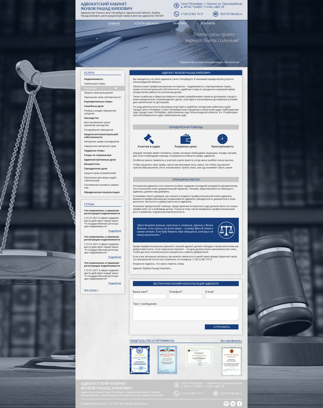

# Сайт адвоката Якубова Рашада Киязовича

## Описание проекта

[Демо](https://cybersunt.github.io/advokat-jakubov/public/) | Техническое задание (отсутсвует)

* **Используемые технологии**: HTML5, CSS3, JS(ES5)
* **Сетка:** Резиновая
* **Адаптив:** да
* **Автоматизация:** Gulp
* **Фреймворки:** нет

* **HTML технологии:** шаблонизатор PUG, разметка по БЭМ
* **CSS технологии:** препроцессор SСSS, для создания сеток использован **flexbox**
* **JS модули**: мобильное меню, галерея (увеличение фото сертификатов), валидация формы
* **Яндекс Карты API**: нет.
* **SVG**: есть
* **Спрайты**: нет

* **Доступность**:
    * при "отвалившемся" JS посетителю будет в мобильной и планшетной версии показано мобильное меню, картинки откроются в браузере по ссылке, встроенная валидация
    *  все картинки имеют подпись, если вдруг будут недоступны
    *  все интерактивные элеменеты доступны с клавиатуры

